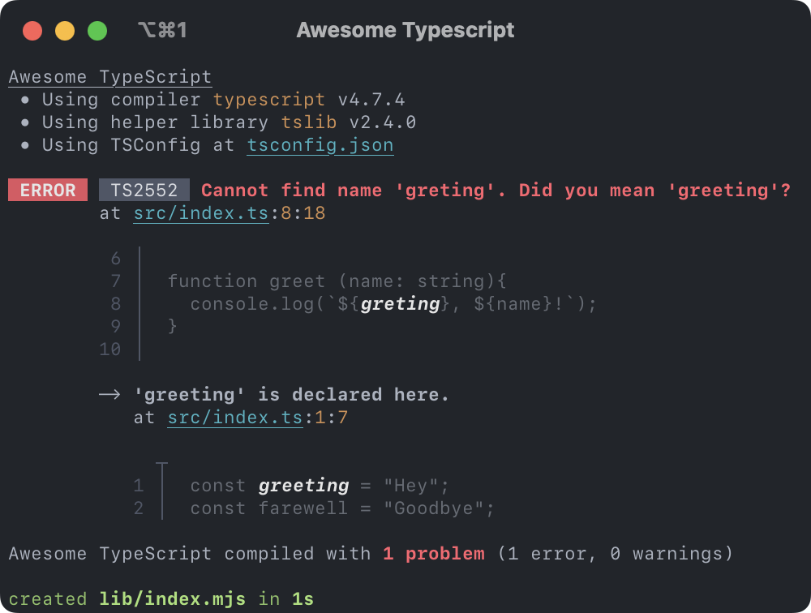

<h1>
  Awesome TypeScript 🚀<br/>
  <sup><em>for Rollup</em></sup>
</h1>

**Make TypeScript development using Rollup fun again!**

<!--  -->

- **Almighty watch mode**  
  Monitors all contributing files, including type-only imports and declaration
  files.
- **Delightful error messages**  
  Detailed and beautifully formatted error messages that display the erroneous
  code and its surroundings to provide more context on what went wrong.

<!-- ZERO CONFIG DROP IN -->
<!-- THIGHT TS CONFIG INTEGRATION: JSON, PATH ALIASES, FILTERS, DECLARATIONS... -->

<!-- - **Blazing fast rebuilds**
  Uses incremental builds to only ever recompile and reevaluate changed files. -->
<!-- - **Monorepo ready**
  Watches extended configuration files, supports project references and
  automatically resolves path aliases. -->

<br>

[](https://npmjs.org/package/rollup-plugin-awesome-typescript)
[](https://liberamanifesto.com)

---

does not yet support custom transformers
does not yet support project references

## Installation

```
npm i -D rollup-plugin-awesome-typescript typescript tslib
```

> Note: Awesome TypeScript requires you to install both `typescript` (≥ 4.5.0)
> and `tslib` (≥ 2.4.0) separately or provide your own compatible
> implementations for them (using the plugin options)

## Usage

## Options

### `check`

Type: `boolean`
Default: `true`

Specifies whether to enable type checking.

### `declarations`

Type: `string` | `boolean`

Specifies if and where to output declaration files. Can be one of the following:

- A directory name, relative or absolute path to enable the output at the
  specified location (ignoring all options in the TSConfig)
- `true` to enable the output using `"declarationDir"` of the TSConfig as the
  location
- `false` to explicitly disable the output of declaration files

If undefined, the options in the TSConfig and are used as is.

### `buildInfo`

Type: `string` | `boolean`

Specifies if and where to store incremental compilation information. Can be one
of the following:

- A directory name, relative or absolute path to enable the output at the
  specified location (ignoring all options in the TSConfig)
- `true` to enable the output using `"tsBuildInfoFile"` in the TSConfig as the
  location
- `false` to explicitly disable the output of declaration files

If undefined, the options in the TSConfig and are used as is.

### `cwd`

Type: `string`
Default: `process.cwd()`

Specifies the current working directory.

### `context`

Type: `string`
Default: The directory containing the TSConfig

Specifies the base path used to parse the TSConfig. Relative paths within the
configuration are resolved with respect to this path.

### `config`

Type: `string`
Default: `"tsconfig.json"`

Specifies the location of the TSConfig. Can be one of the following:

- A relative or absolute path
- A filename to search for in the directory tree, starting from the current
  working directory

### `compiler`

Type: `string`
Default: `"typescript"`

Specifies the TypeScript compiler to use. Can be one of the following:

- A relative or absolute path pointing to a package or an entry file
- The name of a local dependency

### `helpers`

Type: `string`
Default: `"tslib"`

Specifies the TypeScript helper library to use. Can be one of the following:

- A relative or absolute path pointing to a package or an entry file
- The name of a local dependency

## TSConfig

### Forced Options

### Ignored Options
